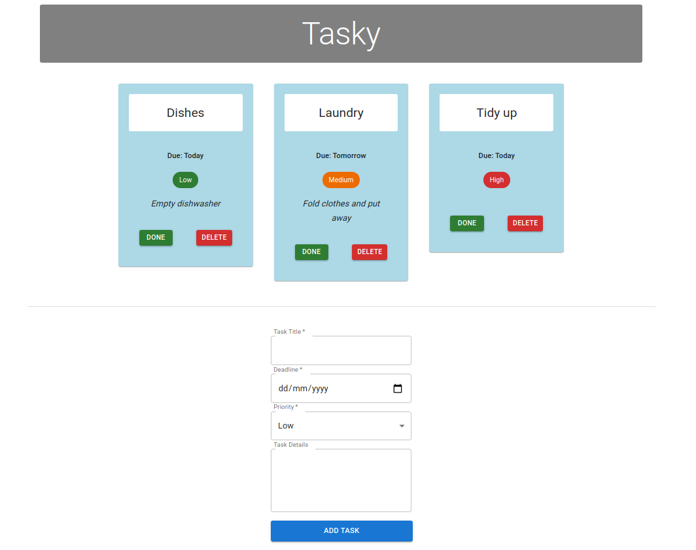

# React Basics Labs - Tasky

## Introduction

This is a simple react project with Material UI.

To Run this project use command: `npm start`, and visit `localhost:3000` in the browser. Make sure all dependent packages have been installed, you can use `npm install` to install them.

Install Material UI: `npm install @mui/material @emotion/react @emotion/styled`,

Install uuid: `npm install uuid`.

This project is aimed to help developer to understand the use of components and their properties. The application of componet library will make development faster and easier.

Here is the screenshot of this complete project.

